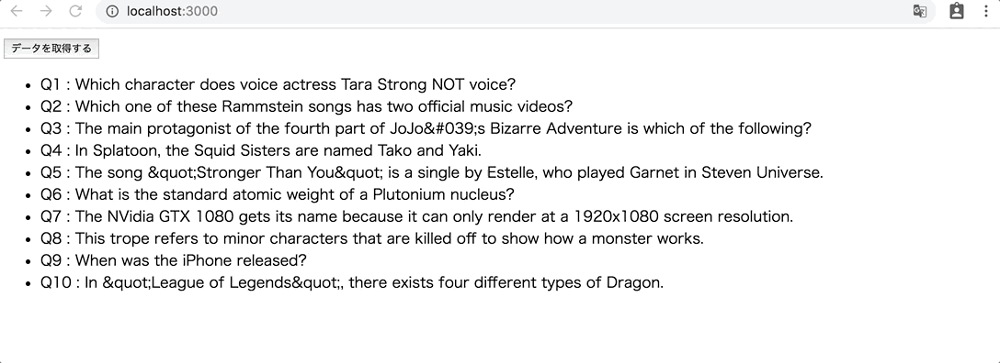

# レポジトリ内容

この課題は、Web白熱教室のReact課題その5「[【エクササイズ】API経由で取得したデータをリスト表示させる](https://tsuyopon.xyz/learning-contents/web-dev/javascript/react/js-exercise-for-react-5/)」の課題レポジトリになります。

## 課題

- 以下の完成形の画像と同じ見た目になるように実装する
- 具体的な実装の流れは、以下の「課題をクリアするためのステップ」の内容を参考にすること

## 完成形

### 課題をクリアするためのステップ

- [ ] 前回の課題である「[【エクササイズ】API経由のデータ取得前後で表示を切り替える](https://tsuyopon.xyz/learning-contents/web-dev/javascript/react/js-exercise-for-react-4/)」で実装したものとほとんど同じのため、まずは前回の課題の実装コードを流用する
- [ ] 前回の課題ではクイズデータ1件だけを表示していたが、今回は全てのクイズデータの問題文を一覧表示させる(上の完成形の画像を参考にすること)
- [ ] `npm start` を実行して、上に貼った「完成形」と同じ見ための表示がされれば完了

## レビュー依頼時の注意

- このプルリクをフォークして作業を開始しても構わないし、自分で `create-react-app` を使ってゼロから環境を作りあげるでも良い。
    - このプルリクをフォークして作業を開始して、最終的にレビューを依頼するときは以下の動画を参考にすること
        - [【動画解説】学習コンテンツの課題に取り組むときの注意点](https://tsuyopon.xyz/learning-contents/github/when-you-try-the-excercise-of-learning-contents/)
    - 自分で `create-react-app` を使ってゼロから環境を作ったものをレビューに投げる時は以下の動画を参考にしてプルリクを作成すること
        - [【動画解説】GitHubにレポジトリをPushするまでの流れ](https://tsuyopon.xyz/learning-contents/github/how-to-push-a-local-repository-to-the-github/)
        - [【動画解説】GitHubでプルリクエストを作るまでの流れ](https://tsuyopon.xyz/learning-contents/github/how-to-create-a-pull-request-on-github/)
- 一般的な開発フローに慣れるために、[git flow](https://qiita.com/KosukeSone/items/514dd24828b485c69a05)で作業を進めることをオススメする
    - masterブランチからdevelopブランチを作成する
    - developブランチからfeatureブランチを作成する
    - featureブランチで作業をして、プルリクエストを作成するときは、developブランチにマージされるように作成する

## 参考記事

課題をこなしていて、行き詰まったら以下の資料を参考にしていただければ解答にたどり着けるかと思います。

- Web白熱教室
    - [【React】コンポーネントのstateの使い方を理解する](https://tsuyopon.xyz/learning-contents/web-dev/javascript/react/understand-and-how-to-use-the-state/)
    - [【React】コンポーネントのライフサイクルを理解する【ライフサイクル図付き】](https://tsuyopon.xyz/learning-contents/web-dev/javascript/react/understand-the-lifecycle-of-components/)
    - [【React】コンポーネントにクリックイベントを実装する](https://tsuyopon.xyz/learning-contents/web-dev/javascript/react/how-to-handle-click-events/)
    - [【React】条件に応じてコンポーネントの表示を切り替える方法](https://tsuyopon.xyz/learning-contents/web-dev/javascript/react/conditional-rendering/)
    - [【エクササイズ】fetchで取得したクイズデータを一覧表示する](https://tsuyopon.xyz/learning-contents/web-dev/javascript/frontend/js-excercise-for-frontend-7/)
    - [【React】配列のmapメソッドを活用してリストを作成する方法](https://tsuyopon.xyz/learning-contents/web-dev/javascript/react/lists-and-keys/)
- プルリクエスト(`git flow` の開発スタイルで機能毎にブランチを分けて実装を進める際に参考になるページ)
    - https://github.com/tsuyopon-xyz/api_server_with_mock_db/pulls?q=is%3Apr+is%3Aclosed
